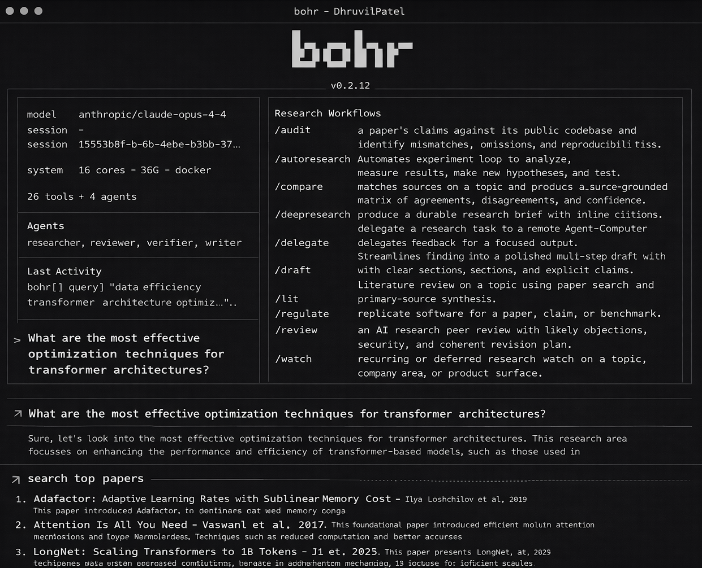

<p align="center">
  <a href="https://github.com/Dhruvil7694/BohrAI">
    
  </a>
</p>
<p align="center">The private AI research system.</p>
<p align="center">
  <a href="https://github.com/Dhruvil7694/BohrAI/tree/main/website/src/content/docs"></a>
</p>

---

### Installation

Bohr ships prebuilt standalone bundles for supported macOS, Linux, and Windows machines. You do not need to deploy a running app before changing these commands; you only need the installer scripts and release assets published at reachable URLs.

**macOS / Linux:**

```bash
curl -fsSL https://raw.githubusercontent.com/Dhruvil7694/BohrAI/main/website/public/install | bash
```

**Windows (PowerShell):**

```powershell
irm https://raw.githubusercontent.com/Dhruvil7694/BohrAI/main/website/public/install.ps1 | iex
```

The one-line installer fetches the latest tagged release. To pin a version, pass it explicitly, for example `curl -fsSL https://raw.githubusercontent.com/Dhruvil7694/BohrAI/main/website/public/install | bash -s -- 0.2.18`.

The installer downloads a standalone native bundle with its own Node.js runtime.

To upgrade the standalone app later, rerun the installer. `bohr update` only refreshes installed Pi packages inside Bohr's environment; it does not replace the standalone runtime bundle itself.

For internal client deployments, do not hardcode the GitHub Raw URLs above. Instead set the deployment variables in `.env.example` such as `PUBLIC_BOHR_SITE_URL`, `PUBLIC_BOHR_INSTALL_BASE_URL`, `BOHR_RELEASES_LATEST_URL`, and `BOHR_INSTALL_BASE_URL`, then publish the same scripts and release bundles on the client's own host. The website homepage already reads those env-based install URLs at build time; the docs page should be published from the same deployment so users copy the correct host-specific command.

Local models are supported through the custom-provider flow. For Ollama, run `bohr setup`, choose `Custom provider (baseUrl + API key)`, use `openai-completions`, and point it at `http://localhost:11434/v1`.

### Skills Only

If you want just the research skills without the full terminal app:

**macOS / Linux:**

```bash
curl -fsSL https://raw.githubusercontent.com/Dhruvil7694/BohrAI/main/website/public/install-skills | bash
```

**Windows (PowerShell):**

```powershell
irm https://raw.githubusercontent.com/Dhruvil7694/BohrAI/main/website/public/install-skills.ps1 | iex
```

That installs the skill library into `~/.codex/skills/bohr`.

For a repo-local install instead:

**macOS / Linux:**

```bash
curl -fsSL https://raw.githubusercontent.com/Dhruvil7694/BohrAI/main/website/public/install-skills | bash -s -- --repo
```

**Windows (PowerShell):**

```powershell
& ([scriptblock]::Create((irm https://raw.githubusercontent.com/Dhruvil7694/BohrAI/main/website/public/install-skills.ps1))) -Scope Repo
```

That installs into `.agents/skills/bohr` under the current repository.

These installers download the bundled `skills/` and `prompts/` trees plus the repo guidance files referenced by those skills. They do not install the Bohr terminal, bundled Node runtime, auth storage, or Pi packages.

---

### Token usage & caveman mode

Long multi-agent runs burn context fast. Bohr mitigates this in several ways:

- **Bundled caveman skill** (`skills/caveman/caveman.md`) — instructs terse, substance-preserving replies. The skill description targets **roughly 75% fewer tokens** on assistant output versus verbose defaults when the model follows the style; actual savings vary by model and task.
- **Paper-generator / Pi subagent path** — prepends short `[CAVEMAN MODE: lite|full|ultra]` instructions, passes **minimal JSON context** (slug, phase, filenames), and uses **file handoffs** instead of dumping large intermediates into the prompt.
- **Configuration** — optional `CAVEMAN_MODE_DEFAULT` and `ENABLE_TOKEN_OPTIMIZATION` in `.env.example` tune subagent compression when using the CLI (dotenv-loaded). See the repo docs: [Token optimization & caveman mode](https://github.com/Dhruvil7694/BohrAI/blob/main/website/src/content/docs/reference/token-optimization.md).
- **Cost planning** — illustrative token and dollar scenarios by provider family (OpenAI, Anthropic, Gemini, Grok, DeepSeek, Chinese APIs), tool fees, and self-host FLOPs intuition: [Cost & token estimation](https://github.com/Dhruvil7694/BohrAI/blob/main/website/src/content/docs/reference/cost-token-estimation.md).

---

### What you type → what happens

```
$ bohr "what do we know about scaling laws"
→ Searches papers and web, produces a cited research brief

$ bohr deepresearch "mechanistic interpretability"
→ Multi-agent investigation with parallel researchers, synthesis, verification

$ bohr lit "RLHF alternatives"
→ Literature review with consensus, disagreements, open questions

$ bohr audit 2401.12345
→ Compares paper claims against the public codebase

$ bohr replicate "chain-of-thought improves math"
→ Replicates experiments on local or cloud GPUs
```

---

### Workflows

Ask naturally or use slash commands as shortcuts.

| Command | What it does |
| --- | --- |
| `/deepresearch <topic>` | Source-heavy multi-agent investigation |
| `/lit <topic>` | Literature review from paper search and primary sources |
| `/lit-review <topic>` | Full literature pipeline with themes, contradictions, gaps, and validator pass |
| `/visuals <topic>` | Data-backed charts, comparison tables, and conceptual generated image assets |
| `/paper <topic-or-artifact>` | Publication-grade paper pipeline with method, figures, and compliance |
| `/paper-pro <topic-or-artifact>` | Professional paper pipeline with evidence map, adversarial checks, citations, and provenance |
| `/review <artifact>` | Simulated peer review with severity and revision plan |
| `/audit <item>` | Paper vs. codebase mismatch audit |
| `/replicate <paper>` | Replicate experiments on local or cloud GPUs |
| `/compare <topic>` | Source comparison matrix |
| `/draft <topic>` | Paper-style draft from research findings |
| `/autoresearch <idea>` | Autonomous experiment loop |
| `/watch <topic>` | Recurring research watch |
| `/hypothesis <topic-or-artifact>` | Ranked, testable hypotheses with explicit falsifiers |
| `/contradict <claim-or-artifact>` | Adversarial contradiction analysis for conclusions |
| `/evidence-score <artifact-or-topic>` | Claim-level evidence strength scoring |
| `/experiment <hypothesis-or-goal>` | Minimal decisive experiment workflow |
| `/citation-check <artifact>` | Sentence-level citation integrity validation |
| `/memory-log <project-or-topic>` | Durable memory consolidation for long-running work |
| `/plan-research <topic-or-goal>` | Planner workflow for agent ordering and stop criteria |
| `/knowledge-graph <artifact-or-topic>` | Build reusable knowledge graph for cross-topic reasoning |
| `/reasoning-validate <artifact>` | Validate logic chain from evidence to conclusions |
| `/iterate <topic-or-artifact>` | Iterative loop controller until confidence/contradiction targets |
| `/outputs` | Browse all research artifacts |

---

### Agents

Ten bundled research agents, dispatched automatically.

- **Researcher** — gather evidence across papers, web, repos, docs
- **Reviewer** — simulated peer review with severity-graded feedback
- **Writer** — structured drafts from research notes
- **Verifier** — inline citations, source URL verification, dead link cleanup
- **Hypothesis** — generate testable hypotheses and ranked falsifiers
- **Contradiction** — find counter-evidence, edge cases, and fragile assumptions
- **Evidence Scorer** — score claim support quality with a transparent rubric
- **Experiment** — design and run minimal experiments to reduce uncertainty
- **Citation Integrity** — validate claim-to-citation alignment at sentence level
- **Memory** — maintain durable project memory across sessions
- **Research Planner** — orchestration brain for agent selection, ordering, and stop rules
- **Knowledge Graph** — convert findings into reusable entities and relations
- **Reasoning Validator** — detect invalid inference chains and logic drift
- **Iteration Controller** — drive multi-loop convergence with explicit thresholds
- **Literature Collector** — collect paper candidates and metadata
- **Literature Quality** — score/filter papers by relevance and recency
- **Literature Synthesizer** — cluster papers into structured themes
- **Literature Contradiction** — detect conflicting claims across papers
- **Literature Gap** — identify missing areas and open problems
- **Literature Review Writer** — write survey-style thematic review
- **Literature Review Validator** — validate completeness, flow, and perspective balance
- **Method Math** — formalize notation, equations, and derivation consistency
- **Figures Tables** — produce publication-ready visuals and captions
- **Paper Compliance** — enforce manuscript structure and submission-style checks

---

### Skills & Tools

- **[AlphaXiv](https://www.alphaxiv.org/)** — paper search, Q&A, code reading, annotations (via `alpha` CLI)
- **Docker** — isolated container execution for safe experiments on your machine
- **Web search** — Gemini or Perplexity, zero-config default
- **Visual generation** — Gemini Nano Banana / Nano Banana Pro or OpenAI image models for conceptual assets, with data-backed charts and tables for factual comparisons
- **Session search** — indexed recall across prior research sessions
- **Preview** — browser and PDF export of generated artifacts
- **Modal** — serverless GPU compute for burst training and inference
- **RunPod** — persistent GPU pods with SSH access for long-running experiments

---

### How it works

Built on [Pi](https://github.com/badlogic/pi-mono) for the agent runtime, [alphaXiv](https://www.alphaxiv.org/) for paper search and analysis, and CLI tools for compute and execution. Capabilities are delivered as [Pi skills](https://github.com/badlogic/pi-skills) — Markdown instruction files synced to `~/.bohr/agent/skills/` on startup. Every output is source-grounded — claims link to papers, docs, or repos with direct URLs.

---

### Contributing

See [CONTRIBUTING.md](CONTRIBUTING.md) for the full contributor guide.

```bash
git clone https://github.com/Dhruvil7694/BohrAI.git
cd BohrAI
nvm use || nvm install
npm install
npm test
npm run typecheck
npm run build
```

[Docs](https://github.com/Dhruvil7694/BohrAI/tree/main/website/src/content/docs) · [Proprietary License](LICENSE)
